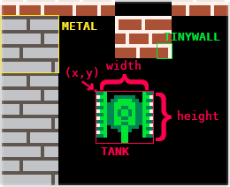
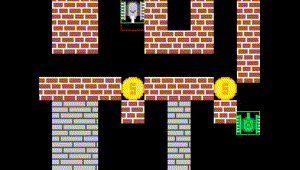

# Collision

 (red border - snap to grid 16x16; green - snap to border of unit)

## Collision types
Game has two types of collisions:

* per 16px×16px grid
* per pixel

## Possible collisions
| collision part | collision type | warnings |
| -------------- | -------------- | -------- |
| bullet↔bullet  | per grid       |          |
| bullet↔wall    | per grid       |          |
| bullet↔tank    | per pixel      |          |
| tank↔wall      | per grid       |          |
| tank↔tank      | per pixel      |          |
| tank↔coin      | per pixel      |          |
